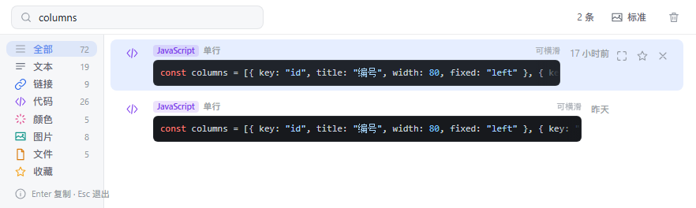
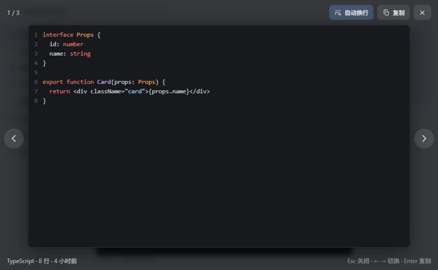

# Y剪贴板

> ZTools 剪贴板历史管理插件 · Vue 3 + TypeScript + Vite

分类清晰、响应飞快的剪贴板管理：文本 / 链接 / 代码 / 颜色 / 图片 / 文件自动分类，支持收藏、搜索与全键盘操作。

## 功能

- **自动分类**：复制的内容按 文本 / 链接 / 代码 / 颜色值 / 图片 / 文件 自动归类，侧栏一键切换；命令行（`npm run build && git add -A`）也归入代码
- **代码块展示**：代码记录用真正的代码块渲染 —— 等宽字体、保留换行与缩进、标注语言（JS/TS/Python/Java/Go/SQL/Shell/JSON/CSS/HTML…）与行数，并做轻量语法着色；**底色恒定用暗色方案**（浅色主题下也是暗底，代码嵌在列表里像一小块编辑器，扫视时一眼就能把它从普通文本里区分出来），超过 5 行折叠成「还有 N 行」

  
- **长代码看得到、看得全**：卡片里的代码块**横向可滚动**（滚轮 / 触控板横滑），溢出的行不再被省略号砍掉；单行真的太长时卡片会说明「超长行已截断 · 展开看全部」。要看全文点卡片上的「展开」（或选中后按 `Space`）进全屏查看：完整行数与字符、行号、默认自动换行（一眼看全），也可关掉换行用横向滚动看原始排版，`Enter` 直接复制

  
- **文件看得见路径**：文件记录逐个列出文件名 + 所在目录，点「定位」直接在系统文件管理器里选中它；文件已被移动或删除时标出「已不存在」
- **打开即能搜**：进入插件自动把焦点交给宿主搜索框（含全选已有关键词），不用先点一下
- **即搜即得**：宿主子输入框输入即过滤（本地即时 + 100ms 防抖补充宿主端搜索），匹配口径与宿主一致（内容 / 文件名 / 预览文案 / 来源应用）
- **收藏**：星标记录存入插件独立存储（dbStorage），原历史被清空也不丢
- **键盘流**：`↑` `↓` 选择 · `Enter` 复制并粘贴到原窗口 · `Space` 全屏看图片 / 看完整代码 · `Delete` 删除 · `Esc` 退出
- **主题适配**：跟随 ZTools 浅色 / 深色主题与主题强调色（唯一例外是代码块：它恒定暗色底，只让描边随主题微调）
- **虚拟滚动**：动态行高窗口化渲染（图片行按真实宽高比撑开），千条记录依然流畅

## 开发

```bash
npm install
npm run dev     # 浏览器打开 http://localhost:5173（自动使用 mock 数据）
npm run build   # 构建到 src-ztools/dist/
```

- 真实环境：ZTools 主窗口输入 `剪贴板` / `clipboard` / `clip` 触发
- 开发模式：`plugin.json` 的 `development.main` 指向 dev server，改代码即时热更新

## 结构

```
├── plugin.json            # 插件配置（功能入口、触发指令）
├── preload/services.js    # 预加载脚本（CommonJS，不可打包压缩）
└── src/
    ├── api.ts             # 宿主 API 封装 + 字段归一化（含图片识别）+ 开发 mock
    ├── types.ts           # 类型定义
    ├── utils/categories.ts # 侧栏分类定义（图标 / 标签 / 配色），图标两两不同由测试守着
    ├── utils/format.ts    # 分类判定、时间格式化、路径解析（文件名 / 目录 / 长路径折叠）
    ├── utils/code.ts      # 代码块：语言识别、行切分与折叠、轻量语法着色（先转义再着色）
    ├── utils/fs.ts        # 本地文件状态查询（走 preload，判断"文件还在不在"）
    ├── utils/image.ts     # 图片显示源解析（本地路径走 preload 读取）
    ├── utils/layout.ts    # 列表度量：文本行固定高、图片行按宽高比撑开、文件行按文件数展开、代码行按行数展开（动态行高）
    ├── composables/useStore.ts  # 状态：分页加载 / 搜索 / 收藏 / 键盘导航 / 图片密度 / 文件定位
    └── components/        # Sidebar / Toolbar / VirtualList（动态行高） / ClipboardItem / CodeCard / FileCard / ImageCard / ImagePreview / CodePreview
```

## 测试

回归测试都用 Node 直接跑 TS，零额外依赖（`npm test` 串联全部）：

```bash
node --experimental-strip-types design/check-images.mts   # 图片记录识别（多形态）
node --experimental-strip-types design/check-layout.mts   # 动态行高与可见区间定位
node --experimental-strip-types design/check-search.mts   # 子输入框注册契约 + 搜索归一化
node --experimental-strip-types design/check-files.mts    # 路径解析 + 文件行高度 + 定位能力降级链
node --experimental-strip-types --import ./design/ts-register.mjs design/check-code.mts    # 代码块：语言识别 / 折叠 / 着色 / XSS / 行高 / 横向可查看
node --experimental-strip-types --import ./design/ts-register.mjs design/check-focus.mts   # 进入插件抢焦点（对 useStore 做集成测试）
node --experimental-strip-types --import ./design/ts-register.mjs design/check-cats.mts    # 侧栏分类：图标唯一性 / path 合法性 / 配色
```

后两个要跑 `ts-register.mjs`（解析钩子，让 Node 认无扩展名的 TS 导入），
因为 `layout.ts` / `format.ts` 会真实 import 业务模块，不再只有类型导入。

`design/` 目录另有 logo 的手工矢量渲染器 `render.cjs`（`node render.cjs` 一键重生成三套方案）。

改过代码块排版后，建议对着真机页面核一次行高（虚拟列表算错会错位）：
打开 dev server，在控制台执行下面的脚本，「全部行的差值」应为 `-6`（即行间距）。

```js
[...document.querySelectorAll('.row')].map(r => {
  const c = r.querySelector('.ccard'); if (!c) return null
  const need = 12 + c.querySelector('.meta').offsetHeight + 4
    + c.querySelector('.code').offsetHeight
    + (c.querySelector('.more')?.offsetHeight ?? 0)
  return need - r.offsetHeight
})
```

## 样式约定

代码块的配色（`--code-bg` / `--code-bg-hover` / `--code-fg` / `--tk-*`）**只在 `:root` 定义**，
`.dark` 里不得覆盖 —— 它要求恒定暗底。若在 `.dark` 里再写一份，等于又变回"随主题走"，
浅色主题下代码块就失去了那块一眼可辨的异色区域。只有 `--code-border` 允许随主题微调
（深色面板本身很暗，暗底与它的明度差小，描边要加一档才看得出边界）。
`design/check-code.mts` 会断言这些规则，改坏了测试会红。

**列表里的代码块是滚动容器，但不准显示横向滚动条**：滚动条一占位就会改变块高，
而虚拟列表的行高是预算好的（差 2px 就足够让整体错位）。所以卡片用
`scrollbar-width: none` 隐藏滚动条，溢出时靠右侧渐变 + 「可横滑」文案提示。
全屏查看不受这条约束（它的高度不由虚拟列表预算），滚动条正常显示。
**另外，DOM 的 `offsetHeight` 是含边框的**：`layout.ts` 里的行高公式必须把
`CODE_BLOCK_BORDER` 算进去，否则会比真实高度少 2px（这是实测才发现的一处偏差）。

**侧栏分类图标必须两两不同**：图标按 16px 渲染，形状一旦接近就完全分不出来
（「全部」和「文本」都曾是三条横线，就是这么撞的）。分类定义统一放在
`utils/categories.ts`，`design/check-cats.mts` 会断言图标唯一、path 合法、配色互不相同。
除了「全部」用中性色（它不是一种内容类型），其余分类的图标直接复用 `KIND_META`，
避免同一类型在侧栏和列表里出现两套图形。

## 宿主 API 要点

签名以 ZTools 仓库 `resources/preload.js` 与 `src/main/api/**` 为准，文档不全：

- `ztools.setSubInput(onChange, placeholder, isFocus)` —— 第一个参数**必须是函数**，回调收到 `{ text }`
- 自动聚焦必须挂在 `ztools.onPluginEnter` 上：宿主进入插件时先 `pluginView.webContents.focus()` 再派发 enter，挂在页面 mount 阶段必被抢走；`onPluginEnter` 带粘性（晚注册也能补收到最近一次 enter）。聚焦用 `subInputFocus()`，已有内容用 `subInputSelect()`
- 子输入框获得焦点后，宿主会把 `↑ ↓ ← → Enter Tab` 通过 `sendInputEvent` 转发给插件页面，所以聚焦搜索框不破坏键盘流
- `ztools.clipboard.getHistory(page, pageSize, filter)` —— `filter` 只支持关键词；返回 `{ items, total, page, pageSize }`
- `ztools.clipboard.search(keyword)` —— 等价于 `getHistory(1, 1000, keyword).items`，返回**裸数组**
- 图片记录的真实字段是 `imagePath`（本地路径）+ `resolution` + `preview`；`files` 是对象数组 `[{path, name, isDirectory, exists}]`
- `ztools.shellShowItemInFolder(fullPath)` —— 在文件管理器中选中文件；老版本宿主没有它时退回 preload 的 `services.revealInFolder()`（Electron shell → `explorer /select,` / `open -R` / `xdg-open`）

## 发布

```bash
git add . && git commit -m "feat: clipboard plugin"
ztools publish
```
